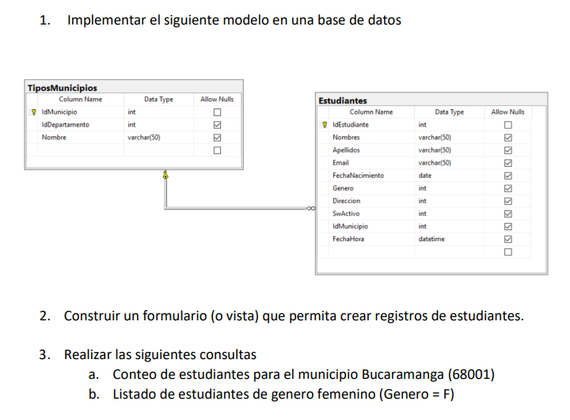

<h1>Prueba de clase de Configuracion y mantenimiento de software</h1>

Taller para realizar un registro en base de datos y consultas

<h2> Caracteristicas</h2>
<ul>
<li>Feedback para el usuario</li>
<li>Validacion de errores en php y feedback</li>
<li>Implementado en PHP
<li>Base de datos en MYSQL</li>
</ul>

<H2> Instalacion </H2>

<ol>
<li>Descargar el proyecto</li>
<li>mover dentro de la carpeta del servidor o carpeta htdocs en C:xampp/htdocs</li>
<li>Iniciar XAMPP apache y MYSQL</li>
<li>importar <a href="database.sql">la base de datos</a> en phpmyadmin</li>
<li>configurar el archivo <a href="config.php">config.php</a> con los datos de la base de datos</li>
<li>Ingresar a localhost/prueba-CMS</li>
<li>Listo :)</li>
</ol>